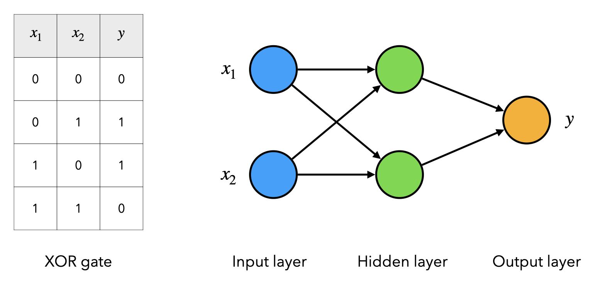
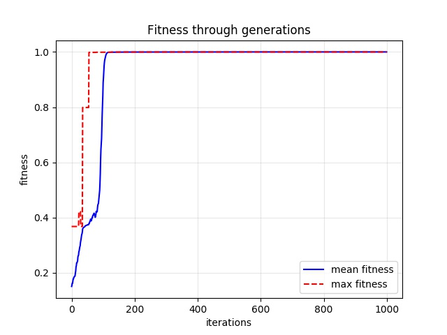
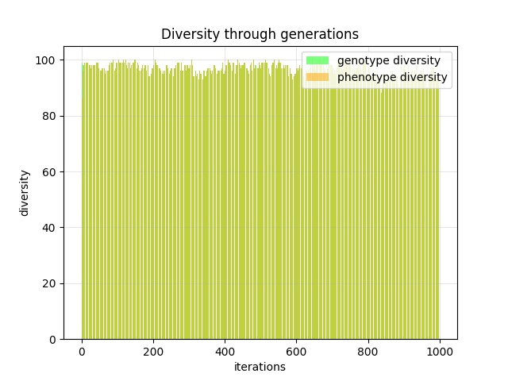

# XOR Neural Network
[Genetic algorithm](https://en.wikipedia.org/wiki/Genetic_algorithm) to train a 3-layer neural network for predicting the [binary exclusive OR (XOR) gate](https://en.wikipedia.org/wiki/XOR_gate).

<p align="center">
    
</p>


## Images

<p align="center">
    
    
</p>


## Installation

To install the dependencies, run the following command:

```bash
pip install -r requirements.txt
```

If using Conda, you can also create an environment with the requirements:

```bash
conda env create -f environment.yml
```

By default the environment name is `xor-nn`. To activate it run:

```bash
conda activate xor-nn
```


## Usage

Run the menu with the following command:

```python
python -m xor_nn
```

